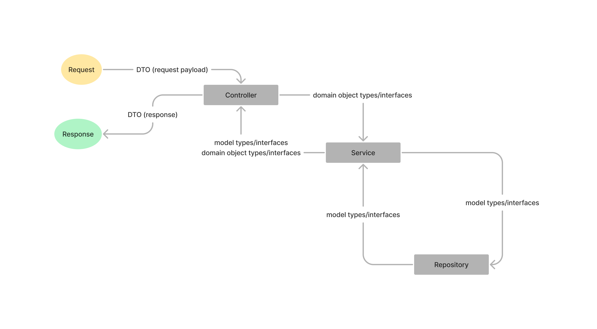

### Architecture

## Flow of data

The system first receives a request that's forwarded to a `controller`
method.

This guy calls on the relevant `service`s which are basically encapsulation of
the business logic. They are (ideally) transparent to underlying CRUD
mechanisms (i.e. the data layer).

Services use `repositories` which abstract away the underlying data structures
that encapsulate the state of the system. These `repositories` are the entry
point to the underlying data layer.

## Assumptions

- In larger codebases, I'd have preferred the `usecase-services-repo` pattern
  over the standard `controller-services` funda, to better encapsulate
  business-logic and separate concerns. But in the interest of time, and to
  avoid complexity, I've stuck to the simpler `controller-services-repository`
  convention.

- No abstract/metaprogramming based function transformations or
  decorators since there are only 2 SWAPI resources at the moment. When the code
  gets repetitive, we can look at the more fancy stuff.

- Assuming the resources (`Planets`, `Movies`) to be de-coupled from each other,
  i.e. they are not considered from a common type (even if their structure seems
  to suggest so). It's easier to couple stuff together into common-ness later,
  but harder to decouple.
    - The `controllers`, `services`, etc. also follow this philosophy.
    - There are common tools to help DRY the code in this case, but that's a
      layer on top, and not modelled as hierarchy (preferring composition to
      inheritance).
